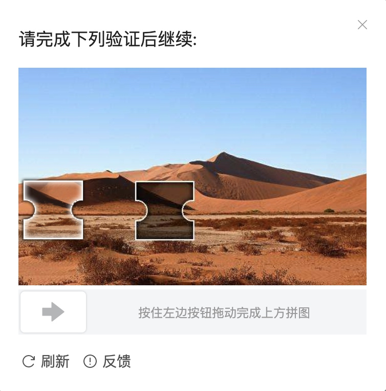
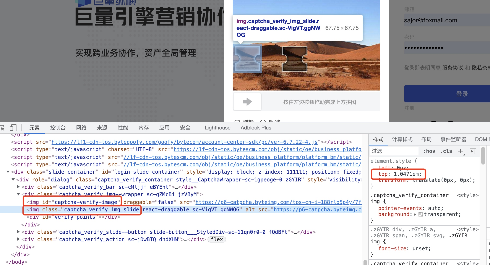
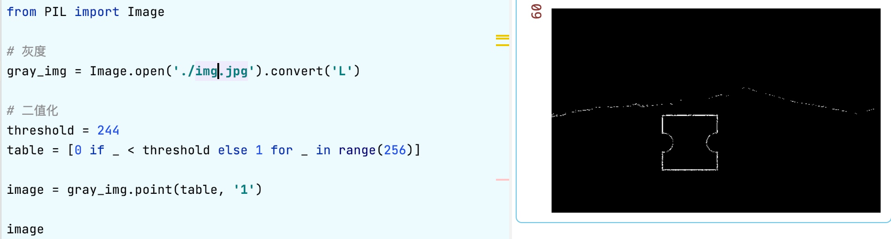
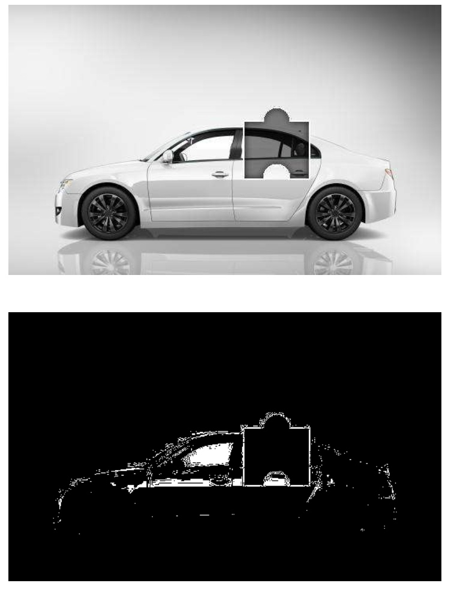
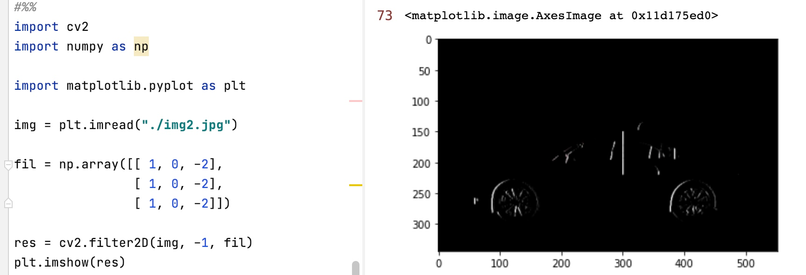
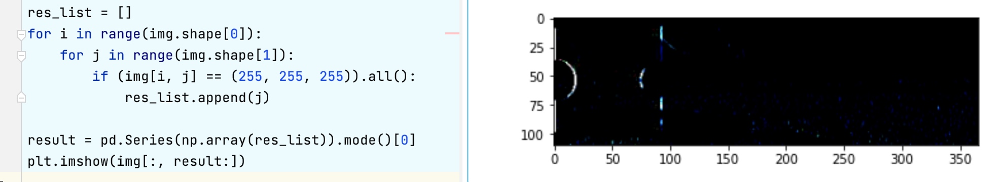
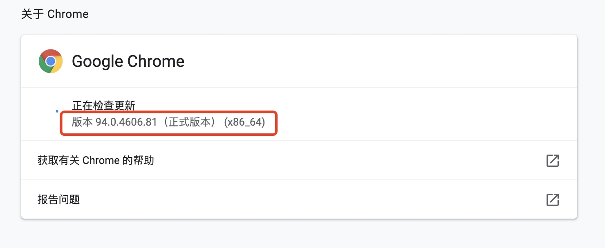

# [滑动验证码识别](https://565785929.github.io/16434266223947.html)

今天的目标地址是字节的[巨量纵横](https://business.oceanengine.com/site/login)，目前东家是一家广告营销型的公司，专注于在各大平台投放信息流广告。巨量纵横为字节跳动的广告平台，用于管理推广账户。今天破解一下这个平台的登陆入口，为今后的数据爬取开个头。

## 涉及工具技术
- selenium
- pandas
- numpy
- opencv
- [Pillow](https://pillow.readthedocs.io/en/stable/)

``` bash
# python 库安装
pip install -r requirements.txt -i https://pypi.tuna.tsinghua.edu.cn/simple
```

## 开始


滑动验证码就是上图这种东西，验证方式就是用鼠标拖动到缺口阴影位置松手即可。

逻辑比较简单，目前要处理的核心问题就是怎么找到这个阴影位置，因为可能有不同的图片而且图片中缺口阴影的位置也不确定。

问题可以简化为：**如何找到背景图中缺口的准确位置**

## 分析

首先通过浏览器检查工具，看一下能获得哪些信息。



首先可以获得**滑块和缺口图片的链接**，还可以获取**滑块图片的高度**

我们先将缺口图片下载下来，通过简单的图像变换看一下有什么特征可以利用。下面Python代码可用于下载图片。

``` python 
from urllib import request

img = 'https://p6-catpcha.byteimg.com/tos-cn-i-188rlo5p4y/7fcb5c88410943579af133942e8f9249~tplv-188rlo5p4y-2.jpeg'

request.urlretrieve(img, './img.jpg')
```

将图片保存下来之后，使用较为通用的处理方法先观察一下图片特点，首先灰度处理，再手动调整阈值观察二值化后的图片。




通过观察可以发现带缺口图片附近有一圈白色痕迹，我们就是要获取到白色方框的左半部分距离整个图片左边的距离。

通过观察二值化后的图片特征，我想到一个办法，就是通过这张二值化后的图片，遍历每一个像素点，找到连续的、在垂直方向均为白色的位置。理论上是可行的，可能验证码图片样本不够，可能会有些图片白色部分较多，比如这张银色的车，白色的色块就比较多。



## 滤波


因为我们只需要缺口的左边位置的坐标，所以可以通过具有提取边缘特征的水平梯度Prewitt卷积核来处理图片。通过测试我选取了下面这个3x3的卷积核。

$$
\begin{bmatrix}
1 & 0 & -2\\
1 & 0 & -2\\
1 & 0 & -2\\
\end{bmatrix}
$$

通过opencv库处理原图，可以发现图片缺口左边部分的边缘被突出显示了出来。


## 结果

有了如上的矩阵就简单了，按照之前的思路，找到垂直方向的白线就可以拿到缺口的坐标。

遍历图片每一个点，将**白色点的x坐标**存入一维数组中，再求该数列的**众数**就能得出缺口的坐标啦！

偷个懒，众数的不优雅表达
`pd.Series(np.array(res_list)).mode()[0]`




## 切图

为了更高的准确率，我们之前还能拿到滑块图片的高度，我们可以将验证码无用部分，也就是缺口部分上下方图片切除掉。


可以通过selenium库 `img.value_of_css_property("top")` 方法获取页面元素属性，拿到滑块图片的高度，通过后面测量，与原图大概是1.65倍(这个不知道是什么单位的倍数，下面会展示计算方法)，滑块高度大约110像素。numpy切片的代码就不放了。切出来的图片类似这样，再进行上面的操作，脑补是能减少误判(没测过😊)


## 控制浏览器

核心难点突破之后就简单多了，使用selenium这个库来控制浏览器，使用代码的方式操纵鼠标键盘。


## 拟合

[拟合](https://zh.wikipedia.org/wiki/%E6%9B%B2%E7%B7%9A%E6%93%AC%E5%90%88): 形象的说，拟合就是把平面上一系列的点，用一条光滑的曲线连接起来。因为这条曲线有无数种可能，从而有各种拟合方法。拟合的曲线一般可以用函数表示，根据这个函数的不同有不同的拟合名字。

程序计算出的缺口位置，和页面上滑块移动的位置有偏差。拖动滑块位置并通过浏览器控制台可以看到滑块贴合缺口时对应的移动位置。


我收集了几组页面滑块位置与程序计算的位置。（可能有点多）

| 页面(y)  | 程序(x)  |
|-----|-----|
| 246 | 407 |
| 190 | 315 |
| 221 | 366 |
| 190 | 316 |
| 97  | 164 |
| 152 | 255 |
| 241 | 398 |
| 226 | 374 |

不知道页面和程序输出的为啥相差这么多，可能两数是有什么关系，但是看不懂前端代码，也懒得分析，就假设几个未知数，解一下方程吧。

假设 二元一次方程 $$ y = ax + b $$ 或者 二元二次方程 $$ y = ax^2 + bx + c $$ ，我记得次方越高，拟合的就会越好。 最后按一元一次解得 a=1.65

## 控制浏览器

这部分要使用selenium库，控制浏览器，我使用的是Chrome，关于如何安装selenium以及Chrome控制器驱动程序[chrome driver](https://registry.npmmirror.com/binary.html?path=chromedriver/)，可以参考百度或者[csdn帖子](https://www.cnblogs.com/lfri/p/10542797.html)。

需要查看自己电脑上的chrome版本和[chrome driver](https://registry.npmmirror.com/binary.html?path=chromedriver/)的版本一致。




## 源码

本文代码已上传至[github](https://github.com/565785929/AutoLoginSlider)，欢迎交流与star。

本文地址：[Sajor's Blog](https://565785929.github.io/16434266223947.html)

未完待续...